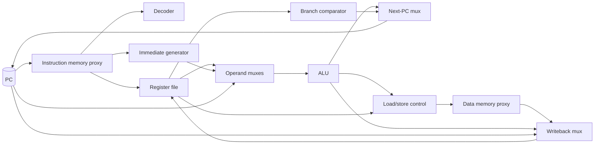
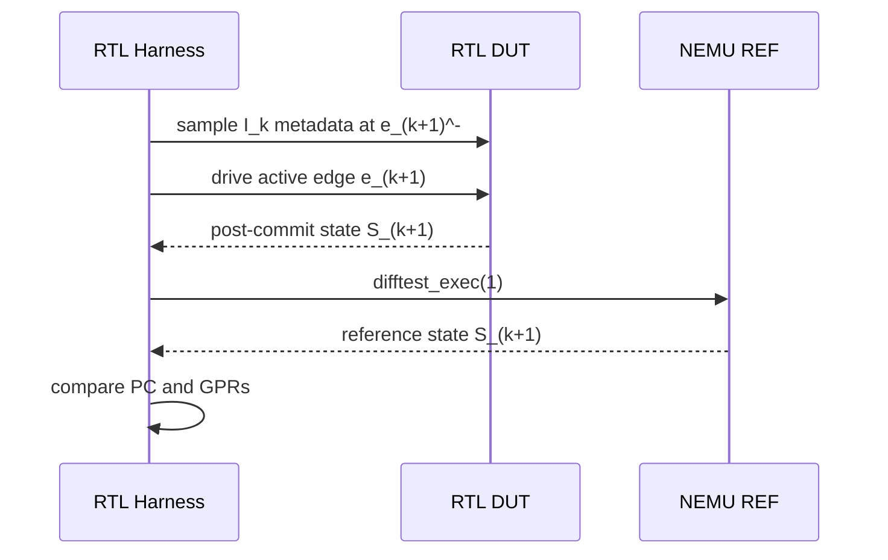
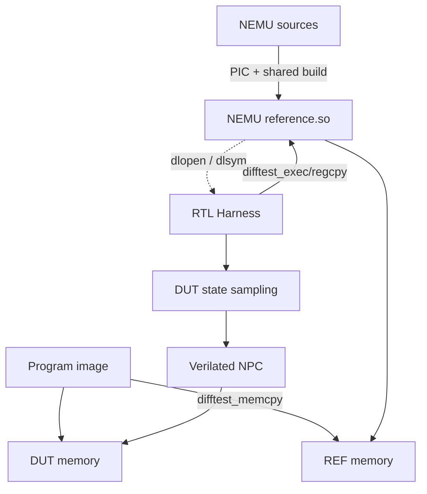

# C4：RV32E 单周期 NPC 与提交级 DiffTest

> 阶段时间：2026-08。本文总结 C4 的处理器架构、运行链路、提交时序、验证框架与阶段边界。C4 的主要成果不是单独实现若干指令，而是形成“程序可运行、状态可观察、错误可定位”的 RTL 验证闭环。

## 1. 阶段结论

当前 NPC 已能一键构建并运行 `riscv32e-npc` AM 程序，支持 RV32E 基本整数、控制流和访存操作；程序通过 `ebreak` 自动报告 GOOD/BAD TRAP。NEMU 可作为动态链接参考模型，DiffTest 在每条指令提交后立即比较 next-PC 和 GPR，并在首个差异处 Abort。

| C4 能力 | 状态 | 证据或边界 |
| --- | --- | --- |
| AM image 构建与装载 | 完成 | 可用 `make ARCH=riscv32e-npc ALL=xxx run` 替换程序，无需重编 RTL 源码 |
| RV32E 单周期数据通路 | 完成基本功能 | ALU、分支/跳转、load/store 通过 CPU tests |
| 自动结束与结果反馈 | 完成 | `ebreak` 触发仿真结束，按 `a0` 区分 GOOD/BAD TRAP |
| SDB | 完成最小范围 | `c/si/info r/x/p/q` 可用；未实现 watchpoint |
| ITrace | 完成 | 提交事件驱动，支持反汇编和最近 16 条指令 ring buffer |
| DiffTest | 完成 C4 所需范围 | NEMU shared object 动态加载；PC/GPR 逐提交比较 |
| 负向注错 | 完成 | 故意破坏 RTL 逻辑及 `ebreak` 前最后一条普通指令均能触发首错 |
| FTrace/MTrace | 未作为出口 | 当前没有形成完整的提交型实现 |
| ALU 综合观察 | 无阶段证据 | 不计入已完成成果，可在后续 PPA 工作中统一补做 |

2026-08-09 与 2026-08-22 的完整回归均为 35/35 PASS。现有能力已经足以结束 C4；调试器扩展、全内存比较和真实存储延迟不应阻塞 C5/C6 的硬件主线。

## 2. 程序如何运行在 NPC 上


构建链路使用 [riscv32e-npc.mk](../../abstract-machine/scripts/riscv32e-npc.mk) 的 `-march=rv32e_zicsr -mabi=ilp32e`，链接地址和复位 PC 均以 `0x80000000` 为基准。[load_img.cpp](../../npc/csrc/load_img.cpp) 将 raw binary 读入 NPC PMEM；RTL 随后通过 DPI-C 读取同一 host memory。

这一区分很重要：ELF 提供符号和反汇编信息，真正放入当前 NPC memory model 的是 flat binary；Verilator 负责执行 RTL，不负责自动加载 guest 程序。

典型命令：

```bash
cd am-kernels/tests/cpu-tests
make ARCH=riscv32e-npc ALL=bubble-sort run
```

## 3. 单周期处理器架构



### 3.1 状态与组合逻辑

架构状态主要由 PC 和 GPR 组成：

- PC 在复位时为 `0x80000000`，有效上升沿选择 `pc+4`、branch/jal target 或清除 bit 0 的 jalr target；
- Register File 当前物理实现为 32 个 32-bit 寄存器，RV32E 软件只使用前 16 个；`x0` 写入被抑制；
- IDU、立即数生成、ALU、branch、load extension 和各级 mux 均为组合逻辑；
- 每个有效周期在同一上升沿更新 PC、写回 GPR，并执行 store 副作用。

主要 RTL 文件：

- [ysyx_core.sv](../../npc/vsrc/core/ysyx_core.sv)：数据通路和控制连接；
- [ysyx_idu.sv](../../npc/vsrc/core/ysyx_idu.sv)：opcode/funct 译码及控制信号；
- [ysyx_gen_imm.sv](../../npc/vsrc/core/ysyx_gen_imm.sv)：I/S/B/U/J 立即数；
- [ysyx_alu.sv](../../npc/vsrc/core/ysyx_alu.sv)：算术、逻辑、比较、移位及现有 M 运算组合逻辑；
- [ysyx_branch.sv](../../npc/vsrc/core/ysyx_branch.sv)：有符号/无符号条件分支；
- [ysyx_regfile.sv](../../npc/vsrc/core/ysyx_regfile.sv)：GPR 读写及 DPI-C 状态导出；
- [ysyx_d_ram_ctrl.sv](../../npc/vsrc/core/ysyx_d_ram_ctrl.sv)：访存宽度和 load 符号/零扩展。

虽然 ALU 中已有组合乘除路径，C4 的软件目标仍是 RV32E；当前工具链会用软件例程处理未由目标 ISA 启用的运算。组合 M 扩展不是本阶段单独验收过的 PPA 设计，后续若保留硬件 M，应重新评估除法关键路径或改为迭代实现。

### 3.2 当前 memory proxy

[ysyx_i_ram.sv](../../npc/vsrc/core/ysyx_i_ram.sv) 和 [ysyx_d_ram.sv](../../npc/vsrc/core/ysyx_d_ram.sv) 实际是 DPI-C memory proxy，不是 cache，也不模拟 SRAM/DRAM 时序：

- 取指和 load 组合读取 host PMEM；
- store 在上升沿调用 DPI-C 写接口；
- 访问地址和 size 直接传给 C++ backend；
- 当前环境按零等待响应运行。

这种模型适合验证 ISA 功能，但不能只把读数据延迟一拍来“模拟真实 RAM”。引入延迟必须同时定义 request/response、valid/ready、PC/写回冻结和提交条件，统一留到 B1 总线阶段。

## 4. 提交时序契约

为避免“第几个周期”的歧义，使用以下记号：

- `e_k`：第 `k` 个有效上升沿；
- `S_k`：`e_k` 后寄存器及组合逻辑收敛后的架构状态；
- `I_k`：由 `S_k` 取出，并在 `e_{k+1}` 提交的指令。

状态转换写作：

```text
I_k: S_k --e_{k+1}--> S_{k+1}
```

当前 harness 的一次循环为：

| 观察点 | 状态与行为 |
| --- | --- |
| `single_cycle()` 前 | DUT 为 `S_k`；保存即将提交的 `I_k` 的 `commit_pc`、指令字和 skip 属性 |
| 有效沿 `e_{k+1}` | PC/GPR/store 更新，`I_k` 提交，状态变为 `S_{k+1}` |
| `single_cycle()` 返回后 | 采集 DUT 的 post-commit `S_{k+1}`，REF 执行 `I_k`，立即比较双方 |



`commit_wb` 在当前单周期核中恒为 1，表示当前指令将在随后的有效沿提交，而不是“上一条指令已经提交”。未来加入 stall、flush 或流水线后，它必须成为与退休级指令对齐的真实 `commit_valid`。

## 5. DiffTest Verification Framework

### 5.1 结构与动态链接



动态链接发生在 NPC host harness，而不是 RTL 或 guest 程序中：[dut.c](../../npc/csrc/difftest/dut.c) 用 `dlopen()` 打开 NEMU shared object，再通过 `dlsym()`解析 API。DUT 和 REF 各有独立的 CPU state 与 memory；共享库只建立函数调用通道，不会自动共享状态。

NEMU 参考端 [ref.c](../../nemu/src/cpu/difftest/ref.c) 提供：

| API | C4 作用 |
| --- | --- |
| `difftest_init()` | 初始化 REF memory 和 ISA state |
| `difftest_memcpy()` | 在 DUT host buffer 与 REF PMEM 之间复制镜像 |
| `difftest_regcpy()` | 双向同步 PC/GPR architectural state |
| `difftest_exec(n)` | 让 NEMU 执行 `n` 条 guest 指令 |
| `difftest_raise_intr()` | C4 不使用；保留给 C6 以后中断/异常扩展 |

### 5.2 初始化与逐提交比较

初始化阶段：

```text
load image into DUT PMEM
  -> initialize NEMU REF
  -> copy program image/memory into REF PMEM
  -> copy initial DUT PC/GPR state into REF
```

普通指令的稳态协议：

```text
DUT commit I_k -> sample DUT S_(k+1)
REF exec I_k   -> sample REF S_(k+1)
compare next-PC and all GPRs
```

这种“提交后立即比较”修正了早期延后一轮比较的问题：`si 1` 返回前已经验证本条指令；`ebreak` 前最后一条普通指令不会漏检；mismatch 后也不会再额外推进 DUT。

C5 加入 MMIO 后，协议扩展为“普通指令比较、非确定 MMIO 指令提交后 DUT→REF 同步”，详细设计见 [C5.md](./C5.md)。

### 5.3 首错定位

DiffTest mismatch 会报告：

- 提交序号；
- 首错指令的 PC、机器码和反汇编；
- DUT/REF next-PC；
- 所有不同 GPR 的编号、ABI 名称和双方数值；
- 最近 16 条已提交指令。

随后 `SimState` 进入 `SIM_ABORT`，停止继续执行。最近提交 ring buffer 始终记录，不受 terminal ITrace 打印阈值影响，可将错误缩小到少量指令后再查看对应 FST 波形。

## 6. Harness、SDB 与可观测性

[sim.cpp](../../npc/csrc/sim.cpp) 驱动时钟/复位、维护运行状态并在提交后调用 ITrace 与 DiffTest；[sdb.cpp](../../npc/csrc/sdb/sdb.cpp) 提供最小交互控制。

| 组件 | 当前作用 |
| --- | --- |
| `SimState` | 区分 RUNNING、STOP、END、ABORT、QUIT，并保存 halt PC/return code |
| `sim_cpu` | harness 中的 DUT architectural snapshot，目前为 PC + 32 GPR |
| `commit_wb/pc_cur/inst` | 沿前采集即将提交的指令元数据 |
| `set_gpr_ptr()` | 将 RTL GPR storage 暴露给 harness |
| ITrace | 对短步执行打印提交指令；长执行请求超过阈值时不刷 terminal |
| FST | 保存 RTL 信号变化，用于 DiffTest 已缩小范围后的波形分析 |
| SDB | continue、single-step、寄存器、内存和表达式检查 |

验证框架围绕 ISA 可见的提交事件设计，而不是依赖 ALU、流水级或 hazard 等内部信号。未来单周期核替换为流水线核时，核心比较器和 REF 可以复用；设计相关信号应由薄 adapter 映射到稳定的 commit/state contract。

## 7. 验证结果

### 7.1 正向回归

```bash
cd am-kernels/tests/cpu-tests
make ARCH=riscv32e-npc run
```

| 日期 | 配置 | 结果 |
| --- | --- | --- |
| 2026-08-09 | RV32E NPC + NEMU DiffTest | 35/35 PASS |
| 2026-08-22 | 加入 C5 MMIO/复位修正后的同一基线 | 35/35 PASS |

测试覆盖算术、移位、比较、分支、函数调用、load/store、长整数运算、排序和递归等软件场景。它证明当前测试集合内的架构结果一致，但不能替代形式验证、随机指令或覆盖率证明。

### 7.2 负向测试

- 故意写错 RTL 运算逻辑时，DiffTest 能在首个错误提交后进入 `SIM_ABORT`；
- 临时破坏 `ebreak` 前最后一条正常指令的 post-state，第 12 条提交立即被捕获；
- 连续执行三次 `si 1`，每条指令均在本次命令返回前完成比较；
- 恢复正确 RTL 后重新运行回归通过。

负向测试验证的是“checker 确实会失败”，而不是只证明 DUT 与一个失效 checker 同时给出 PASS。

## 8. 已知边界与技术债

以下问题不推翻 C4 功能结论，但应在相关阶段收敛：

- `difftest_init_npc()` 当前按整个 `CONFIG_MSIZE` 复制内存，而不是只复制 `img_size`；初始化成本和接口边界不够精确。
- DUT/REF `CPU_state` ABI 依赖双方恰好采用相同的 GPR、PC 排列，尚无 size/offset 静态断言；C6 增加 CSR 时必须统一修改。
- `dlopen()`/`dlsym()`失败只触发 assert，尚未输出 `dlerror()`；DiffTest 也缺少显式关闭模式。
- `is_skip_ref`、`skip_dut_nr_inst`、`ref_pmem` 和全内存检查等遗留逻辑未完整接入当前主路径，应删除或重新设计。
- 当前 data memory 的 `mask` 实际编码访问字节数，不是逐字节 write strobe；C++ 使用原始地址和 1/2/4-byte host 访问。B1 应改为明确的对齐数据与 byte enable 契约。
- `commit_wb` 恒为 1，非法指令、reset、stall 和 flush 尚无有效性语义；流水线阶段必须由真实退休事件驱动。
- `ebreak` 由 harness 在提交沿前识别并停止，没有作为普通 RTL system instruction 完整执行；它满足 C4 测试终止需求，不代表已经实现异常语义。
- I-RAM/D-RAM 参数名包含 cache，但当前没有 tag、valid、hit/miss 或 refill，架构图和项目描述中不应称为 cache。
- FST 默认全程开启；长 benchmark/RTOS 前应增加运行时开关或范围限制。
- Watchpoint、完整 FTrace/MTrace、随机指令、断言、覆盖率与 ALU 综合/PPA 记录尚未完成。

## 9. 阶段产出与后续接口

C4 固化了两个可复用边界：

1. **Architectural commit contract**：提交指令元数据与提交后的 PC/GPR；C6 扩展 CSR，流水线阶段保持协议不变。
2. **Functional memory contract**：RTL 通过 DPI-C 访问 host memory；C5 在其后增加 MMIO，B1 再替换为带握手和延迟的总线事务。

后续阶段的正确推进顺序是：

```text
C5 MMIO/device
  -> C6 CSR/exception/RT-Thread
  -> B1 request-response + AXI4-Lite + random latency
  -> pipeline valid/stall/flush + precise exception
```

C4 之后不再以扩建 C++ 基础设施为主线。新增工具必须直接提高 RTL 首错定位、协议验证或可复现性；否则优先投入处理器、总线、流水线和系统级验证。
