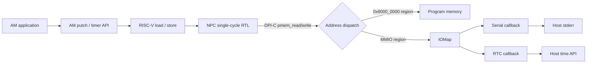

# C5：设备与输入输出

> 阶段时间：2026-08。本文总结 C5 的设计、实现、验证与取舍。当前工程以硬件设计为主线：软件只实现到足以验证硬件接口和系统行为的程度。

## 1. 阶段结论

C5 已建立 NPC 的最小设备闭环：AM 程序通过普通 RISC-V load/store 访问 MMIO，NPC 仿真环境完成地址分发，并用宿主串口和时间 API 模拟设备行为。`hello`、RTC test 和全部 35 项 NPC CPU tests 均已通过，DiffTest 能跨越非确定 MMIO 指令继续检查后续普通指令。

| 讲义要求 | 当前状态 | 说明 |
| --- | --- | --- |
| NEMU PA2.3 输入输出 | 基本完成 | 串口、uptime、键盘和 VGA 已有实现；音频、dtrace 不影响 NPC 主线 |
| NPC 串口与 `hello` | 完成 | 正确输出字符和 `mainargs`，最终 `HIT GOOD TRAP` |
| NPC RTC test | 完成基本功能 | uptime 与日历时间可读，`%02d` 格式正常 |
| 字符版红白机 | 延期 | 当前工程没有移植 `fceux-am`；与 CSR/异常硬件无依赖，不阻塞 C6 |
| VGA/图形版红白机 | 未做 | 属于扩展内容 |

因此，本工程按“是否阻塞硬件主线”的标准结束 C5 并进入 C6。若严格按讲义逐项验收，C5 仍缺字符版红白机运行证据，不将其表述为完整 sign-off。

## 2. 设计概览

MMIO 不需要特殊 CPU 指令。Guest 软件使用 `volatile` 指针产生普通 load/store；处理器计算出物理地址后，仿真环境根据地址将访问送往 PMEM 或设备。



这一实现是 C5 的功能模型，不是最终 SoC 总线。零延迟 DPI-C memory backend 在 B1 接入 request/response、随机延迟和 AXI4-Lite 时会被替换；AM 设备 ABI 和提交级 DiffTest 契约应继续保持稳定。

## 3. 地址与寄存器契约

### 3.1 当前地址空间

| 区域 | 地址范围 | 支持的访问 |
| --- | --- | --- |
| PMEM | `0x80000000`--`0x87ffffff` | 指令和数据读写 |
| RTC | `0xa0000048`--`0xa0000067` | 32-bit read |
| Serial | `0xa00003f8`--`0xa00003ff` | offset 0 的 8-bit write |

AM 和 NPC 配置统一使用 `RTC_ADDR = 0xa0000048`。头文件中还保留键盘、VGA、音频等地址定义，但 NPC 当前没有注册这些设备，访问未知 MMIO 会由 map 层报错，而不是作为 RAM 静默处理。

### 3.2 RTC ABI

| Offset | 内容 |
| ---: | --- |
| `0x00` | uptime 低 32 位，单位为微秒 |
| `0x04` | uptime 高 32 位；读取时生成 64-bit 快照 |
| `0x08` | 秒 |
| `0x0c` | 分 |
| `0x10` | 时 |
| `0x14` | 日 |
| `0x18` | 月，范围 1--12 |
| `0x1c` | 年 |

AM 端先读 `RTC_ADDR + 4`，再读 `RTC_ADDR`，从同一快照组合出 64-bit uptime。这个顺序是设备 ABI 的一部分；若先读低位，随后才生成新快照，就可能拼接出不同采样时刻的高低半部。

## 4. 分层实现

### 4.1 AbstractMachine

- [npc.h](../../abstract-machine/am/src/riscv/npc/include/npc.h) 定义 NPC 设备地址以及 `inb/inw/inl`、`outb/outw/outl`；`volatile` 防止编译器删除、缓存或合并设备访问。
- [trm.c](../../abstract-machine/am/src/riscv/npc/trm.c) 的 `putch()` 向 `SERIAL_PORT` 写一个字节。
- [timer.c](../../abstract-machine/am/src/riscv/npc/timer.c) 实现 `AM_TIMER_UPTIME` 和 `AM_TIMER_RTC`，向应用隐藏寄存器地址和读取顺序。

AM 与 NPC host 代码不会直接调用彼此的设备函数；二者通过一致的地址、宽度和寄存器语义连接。这使同一份 AM application 可以在 NEMU 与 NPC 上运行。

### 4.2 NPC memory 与设备模型

- [paddr.cpp](../../npc/csrc/memory/paddr.cpp) 判断访问是否位于 PMEM；非 PMEM 的 DPI-C 访问转交 `mmio_read()`/`mmio_write()`。
- [mmio.c](../../npc/csrc/memory/mmio.c) 维护设备地址表，查找对应 `IOMap`。
- [map.c](../../npc/csrc/memory/map.c) 为虚拟设备寄存器分配 host memory，并在访问前后调用设备 callback。
- [serial.c](../../npc/csrc/periph/serial.c) 将 offset 0 的单字节写输出到宿主 `stderr`。
- [timer.c](../../npc/csrc/periph/timer.c) 以启动时刻为基准生成微秒级 uptime，并从宿主日历时间填充 RTC 寄存器。
- [device.c](../../npc/csrc/periph/device.c) 在仿真初始化时注册已启用的串口和 RTC map。

一次串口输出的完整路径为：

```text
putch(ch)
  -> outb(0xa00003f8, ch)
  -> RTL store
  -> DPI-C pmem_write()
  -> mmio_write()
  -> map_write()
  -> serial callback
  -> host stderr
```

### 4.3 RTL 与复位期访问

[ysyx_i_ram.sv](../../npc/vsrc/core/ysyx_i_ram.sv) 在复位期间输出 NOP 且不调用 DPI-C。复位解除后才按 PC 取指。

这一约束用于消除 Verilator 首次 `eval()` 的组合收敛瞬态：PC 在复位值稳定前可能短暂为 `0`，若组合取指无条件调用有宿主副作用的 DPI-C 函数，就会产生一次非法地址访问。该瞬态早于常规 FST dump，因此可能“C++ 日志可见、波形中看不到”。

这里也形成了一个后续设计约束：组合逻辑调用 DPI-C 时，必须明确 reset、valid 和访问条件；进入总线阶段后应改为显式 request/response 事务。

## 5. DiffTest 与 MMIO

当前 NEMU reference shared object 只初始化参考内存和 ISA，没有建立可与 DUT 同步的设备世界。即使在 REF 中启用设备，也会遇到两类问题：

- 串口 store 会在 DUT 和 REF 各输出一次；
- RTC load 分别读取宿主时间，合法实现也可能得到不同值。

因此，DiffTest 按提交指令分为两条路径：

```text
ordinary commit: REF exec(1) -> read REF state -> compare DUT/REF
MMIO commit:     skip REF exec -> copy committed DUT state to REF
```

[ysyx_core.sv](../../npc/vsrc/core/ysyx_core.sv) 当前将 `0xa...` 地址上的 load/store 标记为 MMIO；harness 在该指令提交后用 DUT 的 PC/GPR 重建共同基线。skip 会放弃对该条指令全部架构效果的参考检查，因此 MMIO 地址、数据、宽度和写掩码仍需依靠定向测试和后续 transaction assertion 验证。

这个策略的目标是隔离“处理器架构状态比较”与“非确定设备模型”，而不是让错误设备访问自动通过。

## 6. `klib` 输出支持

RTC test 使用 `%02d`，原有简化 `printf` 会将其错误显示为 `2d`。C5 同期统一了 [stdio.c](../../abstract-machine/klib/src/stdio.c) 的格式化核心：

- 支持 `%d/%i/%u/%x/%X/%o/%p/%c/%s/%%`；
- 支持宽度、精度及 `-`、`0`、`+`、空格、`#`；
- 支持 `l/ll/z` 长度修饰；
- `snprintf` 在空间不足时截断输出，同时返回完整结果所需长度。

当前不支持浮点、`%n` 和 `h/hh`。这已经覆盖 AM tests 和现有 benchmark，不继续扩展 libc 功能。

## 7. 验证结果

| 测试 | 命令 | 结果 |
| --- | --- | --- |
| NPC hello | `make ARCH=riscv32e-npc run mainargs=I-love-ysyx` | 正确输出 `Hello, AbstractMachine!` 和参数，DiffTest ON，GOOD TRAP |
| NPC RTC | `make ARCH=riscv32e-npc run mainargs=t` | uptime 按秒递增，日历和零填充格式正常 |
| NPC CPU regression | `make ARCH=riscv32e-npc run` | 2026-08-22：35/35 PASS，DiffTest 开启 |
| NEMU CPU regression | `make ARCH=riscv32-nemu run` | 35/35 PASS |
| NEMU CoreMark | `make ARCH=riscv32-nemu run` | 1000 iterations PASS，CRC 正常 |
| `klib` formatter | host 定向测试及上述 AM 程序 | 宽度、精度、符号、进制、截断和 `INT_MIN` 用例通过 |

RTC test 是持续运行程序，自动验证时需要用 `timeout` 限制运行时间；退出码 `124` 表示外部超时终止，不代表测试失败。

## 8. 关键问题与经验

### 8.1 已解决

1. **启动前 PMEM 越界：** 根因是 reset 收敛前的组合 DPI-C 取指，而不是程序真实访问地址 `0`；通过复位门控和默认 NOP 消除。
2. **首个串口字符后 REF 越界：** MMIO skip 原先只识别 load，NEMU REF 仍执行 serial store；将 store 纳入同一提交标志后解决。
3. **RTC 显示 `2d:2d:2d`：** 根因是 `klib printf` 未解析 `%02d`，不是 RTC 数据错误。

### 8.2 已知边界与技术债

以下问题应记录，但不阻塞 C6：

- timer callback 的 offset 断言条件当前不能有效拒绝越界；map 层也应检查整个 `[addr, addr + len)` 而不只是起始地址。
- 日历字段在每次读取时重新采样，跨秒边界可能不一致；长期应采用整组快照，并明确输出使用本地时间还是 GMT。
- `uncache_read_wb` 实际表示“提交指令为 MMIO load/store”，宜改名为 `commit_is_mmio`，并最终使用统一 address map，而不是长期依赖最高四位判断。
- `find_mapid_by_addr()` 中遗留的 `difftest_skip_ref()` 与 harness 当前显式 skip 路径未统一，存在无效状态和层间耦合。
- `paddr_*` 是完整物理地址入口，DPI-C `pmem_*` 又重复执行 PMEM/MMIO 分发；后续可将 DPI 接口改为语义明确的 adapter，并委托给唯一的 `paddr_*` 路径。
- 当前 I-RAM/D-RAM 是零延迟功能模型。不能只给返回数据增加一拍；固定/随机延迟必须与 valid/ready、等待和提交控制一起在 B1 实现。
- 长程序默认生成完整 FST 会增加仿真时间和磁盘占用，运行 RT-Thread 前宜增加运行时开关或范围限制。

## 9. 阶段取舍与后续

本阶段的核心产出是可复用的 MMIO 契约和软硬件访问闭环，而不是设备数量。字符版红白机能够增加系统级运行覆盖，但其移植工作主要落在软件和工程集成，对 C6 的 CSR、`ecall`、`mret` 与异常状态转移没有直接依赖，因此延期处理。

C6 从以下最小链路继续：

1. NEMU 实现必要 CSR、CSR 指令、`ecall`、`mret` 和异常入口，作为参考模型；
2. AM CTE 通过 yield test，确认 trap frame 与返回路径；
3. NPC RTL 实现最小 M-mode CSR 和同步异常；
4. DiffTest 扩展 CSR 状态比较；
5. 先用 `am-tests` 和 `yield-os` 验证，再接入已有 RT-Thread AM port。

软件工作的退出准则保持不变：能够构造硬件场景、提供参考结果和形成回归证据即可；VGA、游戏、完整 libc、复杂模拟器功能不应抢占 RTL、总线、流水线和验证闭环的投入。
